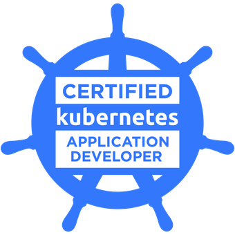
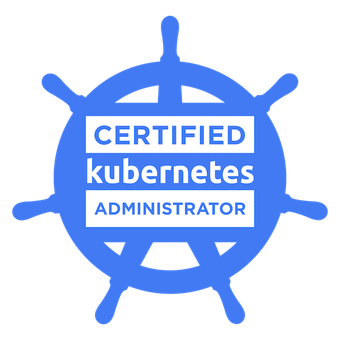

I have a Bachelor’s degree in Electrical Engineering with an emphasis on computing, control, and automation, and I am currently pursuing a Master’s degree. I have experience in Python development, application containerization, and Linux system administration, container orchestration, CI/CD pipeline development, data science, and artificial intelligence/machine learning.

## Skills

* **Programming Languages**: Python, Golang, Shell Script, C++, C, SQL
* **Python libraries/frameworks**: Numpy, Pandas, Matplotlib, Scikit-learn, OpenCV, PyTorch, Tensorflow, Keras, FastAPI, Flask, SQLAlchemy, Pydantic, OpenTelemetry, Prometheus, Protocol Buffers, PyTest, Setuptools, Poetry, Pyka, ROS 2
* **Backend Database/System**: RabbitMQ, PostgreSQL
* **DevOps**: Git, GitHub, GitLab, Ansible, Docker, Podman, Kubernetes, Grafana, Prometheus, OpenTelemetry
* **Tools**: LaTex, Microsoft Word/Excel/PowerPoint
* **Embedded systems**: Arduino, Raspberry PI (3, 4)
* **Operations systems**: Windows, Linux (Ubuntu)
* **Project Management**: Kanbam, Scrum, Jira, Confluence

## Certifications

    
    

## Courses

* **2025**
    * **Nov**: AWS Educate Machine Learning Foundations - AWS - [Certificate](https://www.credly.com/badges/0d6cc1ac-63f5-4ec4-ae8f-c02afad9d50d/public_url)
    * **Sep**: PostgreSQL Summary Stats and Windows Functions - DataCamp - [Certificate](https://www.datacamp.com/completed/statement-of-accomplishment/course/d41a619a664974c670e9a22eee042e738ee43ee0)
    * **Aug**: Data Manipulation in SQL - DataCamp - [Certificate](https://www.datacamp.com/completed/statement-of-accomplishment/course/9c9cf63973ce90a2ab025eb991187a156433722b)
    * **Aug**: Joining Data in SQL - DataCamp - [Certificate](https://www.datacamp.com/completed/statement-of-accomplishment/course/64d2b1c61f0b6be60c01fb3698cb3e73ae704fd0)
    * **Aug**: Intermediate SQL - DataCamp - [Certificate](https://www.datacamp.com/completed/statement-of-accomplishment/course/a0c7a4b8fb6d44ff41406bfafb67c16983813ca0)
    * **Aug**: Introduction SQL - DataCamp - [Certificate](https://www.datacamp.com/completed/statement-of-accomplishment/course/b2f0e970b83e9cc082c1be83578a71a80b6427e4)
* **2024**
    * **Aug**: LFD259 - Kubernetes for Developers - The Linux Foundation - [Certificate](https://www.credly.com/badges/68ff7124-78cb-4fb4-bc52-0fd7ac66303e)
    * **Aug**: LFS158 - Introduction to Kubernetes - The Linux Foundation - [Certificate](https://www.credly.com/badges/477c4e63-f723-48d4-9f80-8342df70097a/public_url)
